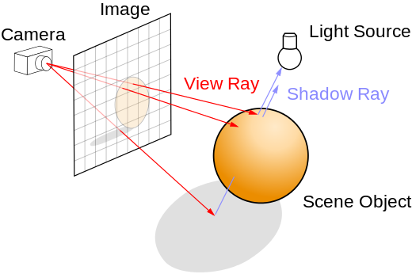
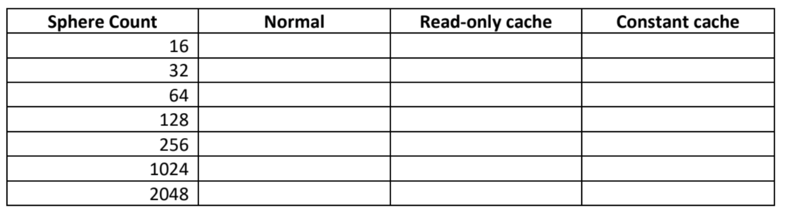
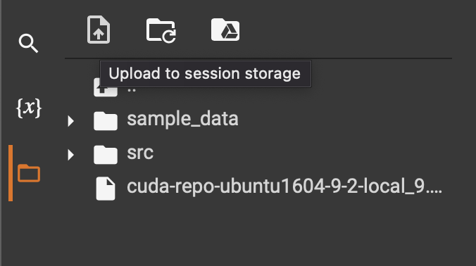

## TP3 : Programmation GPU en CUDA

### Erreur sur la fonction d'écriture de l'image:
-------------------------------------------------

Il y a une erreur sur la fonction lors de la génération de l'image.
Voici la fonction corrigé permettant de bien generer l'image output.ppm
```C
void output_image_file(uchar4* image)
{
	FILE *f; //Permet de contenir le fichier output.ppm

	//ouvre le fichier output.ppm et ecris des info en en-tete
	f = fopen("output.ppm", "wb");
	if (f == NULL){
		fprintf(stderr, "Error opening 'output.ppm' output file\n");
		exit(1);
	}
	fprintf(f, "P6\n");
	fprintf(f, "#Programmation GPU CUDA\n");
	fprintf(f, "%d %d\n%d\n", IMAGE_DIM, IMAGE_DIM, 255);
	for (int x = 0; x < IMAGE_DIM; x++){
		for (int y = 0; y < IMAGE_DIM; y++){
			int i = x + y*IMAGE_DIM;
			fwrite(&image[i], sizeof(unsigned char), 3, f); //only write rgb (ignoring a)
		}
	}
	
	fclose(f);
}
```

### Objectifs du TP :
---------------------
* Comprendre et observer les différences entre le cache constant (constant cache) et le cache de lecture seul (read-only cache)
* Comprendre comment utiliser le cache de texture pour les problèmes qui correspondent naturellement à des domaines 2D.

### Informations sur le TP :
----------------------------
* Le TP est à réaliser seul ou en binôme.
* A rendre sur ametice en spécifiant si vous avez fait le TP seul ou en binôme, en mentionnant votre prénom ainsi que votre nom (prénom et nom de chaque membre si en binôme).
* A rendre avant le 27 Mars 2022, 24:00.


### Exercice 1 : Ray tracing
-------------------------------------------

* Vous programmerez sur le fichier **exercice01.cu**

Pour cet exercice, nous allons optimiser une application simple de ray tracing en changeant
les types de mémoire utilisés.

Cette technique de rendu consiste, pour chaque pixel de l'image à générer, à lancer un rayon depuis le point de vue (la « caméra ») dans la « scène 3D. Le premier point d'impact du rayon sur un objet définit l'objet concerné par le pixel correspondant.

Des rayons sont ensuite lancés depuis le point d'impact en direction de chaque source de lumière pour déterminer sa luminosité (est-il éclairé ou à l'ombre d'autres objets ?). Cette luminosité, combinée avec les propriétés de la surface de l'objet (sa couleur, sa rugosité, etc.), ainsi que d'autres informations éventuelles (angles entre la normale à l'objet et les sources de lumières, réflexions, transparence, etc...), déterminent la couleur finale du pixel.



Vous pouvez lire le chapitre 6 du livre CUDA by Example sur lequel cet exercice est basé (lien sur ametice). 

Il y a beacoup d'éléments dans le squelette du programme exercice01.cu. Prenez le temps de comprendre de quoi il en retourne. Pour le moment, les kernels sont tous définit avec le même ensemble d'instructions. Ils font tous la même chose. Vous adapterez certains kernels pour utilisé le cache constant et le cache en lecture seule. Des explications sur ces caches vous seront fournis dans les exercices du TP.

#### 1.1. Partie Host

Dans la fonction **main**,

```C
#define IMAGE_DIM 2048
#define MAX_SPHERES 16

#define rnd( x ) (x * rand() / RAND_MAX)
#define INF     2e10f
```

- IMAGE_DIM, dimension en x. de l'image (dimension totale = IMAGE_DIMxIMAGE_DIM)
- INF sera la valeur retourné par la fonction sphère_intersect si jamais le rayon n'intersecte aucun objets.

```C
unsigned int image_size, spheres_size;
uchar4 *d_image;
uchar4 *h_image;
cudaEvent_t     start, stop;
Sphere h_s[MAX_SPHERES];
Sphere *d_s;
float3 timing_data;
```

- d_image correspond à l'image qui sera généré par le kernel effectuant le ray tracing
- h_image correspond à l'image sur CPU récupéré à partir de d_image
- h_s est un tableau structure Sphere de taille définit par MAX_SPHERES
- Sphere *d_s et un tableau de structure Sphere que l'on allouera de façon dynamique sur le GPU
- image_size est la taille de l'image en octets
- spheres_size est le nombre de sphere en octets

##### 1.1.1. Allocation de la mémoire du CPU vers le GPU pour l'image et les sphères

Completez les instructions suivante :

```C
	// Ex 1.1.1 Allocation de la memoire pour l'image et les spheres sur le GPU
	cudaMalloc(A completer);
	cudaMalloc(A completer);
	checkCUDAError("CUDA malloc");
```

##### 1.1.2. Copie de la mémoire du CPU vers le GPU pour les sphères

Completez les instructions suivante :

```C
	// 1.1.2 Copie de la memoire du CPU vers le GPU pour les spheres
	cudaMemcpy(A completer);
	checkCUDAError("CUDA memcpy to device");
```

##### 1.1.3. Copie du résultat depuis le Device vers l'Host.

Completez l'instruction suivante :

```C
	// 1.1.3 Copy le resultat d_image sur h_image du GPU vers le CPU
	cudaMemcpy(A completer);
	checkCUDAError("CUDA memcpy from device");
```

##### 1.1.4 Executer le programme

Exécuter le programme, il devrait vous afficher le temps d'execution pour le mode normal.
Il devrait aussi généré un ficher output.ppm vous affichant les sphères.

il vous est possible d'ouvrir ce type de fichier avec un logiciel comme GIMP

##### Sur google colab
Vous avez juste besoins d'executer la commande python suivante (déjà implémenter dans le jupyter notebook)

```python
from PIL import Image
im = Image.open("./output.ppm")
im
```

#### 1.2. Implémentation GPU

Le code initial place les sphères dans la mémoire globale du GPU. 

Il existe deux options pour améliorer cela sous la forme de mémoire constante et de mémoire de texture/lecture seule.


##### 1.2.1 Modification du code pour l'execution avec le read-only cache

Les GPU NVIDIA (par exemple Kepler) possèdent un cache conçu pour les données en lecture seule qui peut, pour certains codes, améliorer les performances d'accès aux données. Ce cache ne peut être utilisé que pour les données qui sont en lecture seule pendant la durée de vie du kernel. Pour utiliser le cache de données en lecture seule, le compilateur doit déterminer quelles données ne sont jamais écrites. En raison du risque d'aliasing, le compilateur ne peut pas être sûr qu'un pointeur fait référence à des données en lecture seule, à moins que le pointeur ne soit marqué à la fois par const et \_\_restrict\_\_. 

Example : 

```C
__global__ void example3a(float* a, float* b, int* c) {
  int index = blockIdx.x * blockDim.x + threadIdx.x;
  b[index] = a[c[index]];
}
```
Dans cet example, a et c sont des données que l'on ne modifie jamais, dans ce cas, les modifications à apporter pour dire au compilateur que a et c sont read-only dont :

```C
__global__ void example3b(float const* __restrict__ a, float* b, int const*  __restrict__ c) {
  int index = blockIdx.x * blockDim.x + threadIdx.x;
  b[index] = a[c[index]];
}
```
Dans notre example, les threads récuperent les informations des sphères mais ne les modifient jamais.

##### Modifier la fonction suivante de sorte à utiliser le cache de lecture seule pour les sphères  :

```C

// Ex 1.2.1 (1/3)
__device__ float sphere_intersect_read_only(Sphere* s, float ox, float oy, float *n) {
	float dx = ox - s->x;
	float dy = oy - s->y;
	float radius = s->radius;
	if (dx*dx + dy*dy < radius*radius) {
		float dz = sqrtf(radius*radius - dx*dx - dy*dy);
		*n = dz / sqrtf(radius * radius);
		return dz + s->z;
	}
	return -INF;
}
```
##### Modifiez le kernel suivant de sorte à utiliser le cache de lecture seule pour les sphères :

```C
// Ex 1.2.1 (2/3)
__global__ void ray_trace_read_only(uchar4 *image, Sphere *d_s) {
	// associe les threadIdx/BlockIdx au position des pixels.
	int x = threadIdx.x + blockIdx.x * blockDim.x;
	int y = threadIdx.y + blockIdx.y * blockDim.y;
	int offset = x + y * blockDim.x * gridDim.x;
	float   ox = (x - IMAGE_DIM / 2.0f);
	float   oy = (y - IMAGE_DIM / 2.0f);

	float   r = 0, g = 0, b = 0;
	float   maxz = -INF;
	for (int i = 0; i<d_sphere_count; i++) {
		Sphere *s = &d_s[i];
		float   n;
		float   t = sphere_intersect(s, ox, oy, &n);
		if (t > maxz) {
			float fscale = n;
			r = s->r * fscale;
			g = s->g * fscale;
			b = s->b * fscale;
			maxz = t;
		}
	}

	image[offset].x = (int)(r * 255);
	image[offset].y = (int)(g * 255);
	image[offset].z = (int)(b * 255);
	image[offset].w = 255;
}
```


##### Decommentez les instructions suivantes :

```C
// 1.2.1 (3/3) On genere une image a partir de nos sphere en lancant le kernel (avec le cache lecture seule)
// cudaEventRecord(start, 0);
// ray_trace_read_only << <blocksPerGrid, threadsPerBlock >> >(d_image, d_s);
// cudaEventRecord(stop, 0);
// cudaEventSynchronize(stop);
// cudaEventElapsedTime(&timing_data.y, start, stop);
// checkCUDAError("kernel (read-only)");
```

##### Calculez le temps d'exécution de la nouvelle version et de l'ancienne version afin de pouvoir les comparer directement.

##### 1.2.2. Modification du code pour l'execution avec le constant cache.

Les GPUs NVIDIA fournissent 64 Ko (peut varier) de mémoire constante qui est exploitée différemment de la mémoire globale standard. Dans certaines situations, l'utilisation de la mémoire constante au lieu de la mémoire globale peut réduire la bande passante de la mémoire (ce qui est bénéfique pour les kernels). La mémoire constante est également plus efficace lorsque tous les threads accèdent à la même valeur en même temps (c'est-à-dire que l'index du tableau n'est pas fonction de la position).

En pratique, la taille de la mémoire constante est plutôt petite, elle est donc surtout utile pour stocker des données qui ne changent pas pendant l'exécution du kernel.

On declare une variable dans la mémoire constante en specifiant \_\_constant\_\_ :

```C
__constant__ int mavariable;

```

##### Déclarer un tableau de sphères d_const_s de taille MAX_SPHERES dans la mémoire constante. 
```C
// Ex 1.2.2 (1/3), La memoire constante se declare de la meme facon qu'une variable ou fonction device (cf. CM2), 
// et sera alloue au temps de compilation.
// Ecrivez le code correspondant a l'exercice 1.2.2 ici:

__constant__ unsigned int d_sphere_count
// Fin du code pour l'exercice 1.2.2
```
##### Supprimer Sphere *d_s des arguments du kernel suivant
##### Modifier ensuite le kernel de sorte à utiliser le tableau de sphère précèdemment déclaré dans la mémoire constante.

```C
// Ex 1.2.2 (2/3)
__global__ void ray_trace_const(uchar4 *image, Sphere *d_s) {
	// associe les threadIdx/BlockIdx au position des pixels.
	int x = threadIdx.x + blockIdx.x * blockDim.x;
	int y = threadIdx.y + blockIdx.y * blockDim.y;
	int offset = x + y * blockDim.x * gridDim.x;
	float   ox = (x - IMAGE_DIM / 2.0f);
	float   oy = (y - IMAGE_DIM / 2.0f);

	float   r = 0, g = 0, b = 0;
	float   maxz = -INF;
	for (int i = 0; i<d_sphere_count; i++) {
		Sphere *s = &d_s[i];
		float   n;
		float   t = sphere_intersect(s, ox, oy, &n);
		if (t > maxz) {
			float fscale = n;
			r = s->r * fscale;
			g = s->g * fscale;
			b = s->b * fscale;
			maxz = t;
		}
	}

	image[offset].x = (int)(r * 255);
	image[offset].y = (int)(g * 255);
	image[offset].z = (int)(b * 255);
	image[offset].w = 255;
}
```
##### Decommenter et Completer la copie de mémoire depuis le CPU vers la mémoire constante du GPU.

```C
// Ex 1.2.2 (3/3), Copie les donnees dans la memoire constante
// cudaMemcpyToSymbol(A completer, h_s, spheres_size);
```

A quoi peut bien servir cudaMemcpyToSymbol ? Pourquoi ne pas utiliser cudaMemcpy ? [lien utile](https://docs.nvidia.com/cuda/cuda-runtime-api/group__CUDART__MEMORY.html)

##### Decommenter les instructions suivantes :

```C
	// 1.2.2 (4/4) On genere une image a partir de nos sphere en lancant le kernel (avec le cache constant)
	// cudaEventRecord(start, 0);
	// ray_trace_const << <blocksPerGrid, threadsPerBlock >> >(d_image);
	// cudaEventRecord(stop, 0);
	// cudaEventSynchronize(stop);
	// cudaEventElapsedTime(&timing_data.z, start, stop);
	// checkCUDAError("kernel (const)");
```

##### Calculer le temps d'exécution de la nouvelle version et des anciennes versions afin de pouvoir les comparer directement.

Que remarqué vous au niveau des temps d'éxecutions ?

##### 1.2.3 Completer le tableau suivant :

Modifiez le nombre de sphères pour compléter le tableau suivant. Pour un défi supplémentaire (optionnel), essayez de le faire automatiquement de manière à boucler sur toutes les tailles de sphères du tableau et d'enregistrer les temps dans un tableau 2D.




### Exercice 2 : Image blurring (flou d'image)
------------------------------------------------

Dans l'exercice 2, vous allez expérimenter l'utilisation de la mémoire de texture. Dans cet exemple, nous allons utiliser explicitement la mémoire de texture plutôt que d'utiliser des qualificateurs pour forcer les chargements de mémoire via le cache en lecture seule. Il y a de bonnes raisons de le faire lorsqu'il s'agit de problèmes liés aux images ou de problèmes qui se décomposent naturellement en 2 dimensions. 

La mémoire de texture est encore un autre type de mémoire read-only. Avec l'avènement de CUDA, la mémoire de texture sophistiquée du GPU peut également être utilisée à des fins de calcul général. Bien qu'elle ait été conçue à l'origine pour le rendu OpenGL et DirectX, la mémoire de texture possède des propriétés qui la rendent très utile. Comme la mémoire constante, la mémoire de texture est mise en cache sur la puce, elle peut donc fournir une bande passante effective plus élevée que celle obtenue en accédant à la mémoire globale. En particulier, les caches de texture sont conçus pour des modèles d'accès à la mémoire présentant une grande localité spatiale.

Caractéristique du monde graphique, les textures sont des images qui sont étirées, tournées et collées sur des polygones pour former les graphiques 3D que nous connaissons. L'utilisation de textures pour le calcul par le GPU permettent un accès aléatoire rapide aux tableaux et utilisent un cache pour fournir une agrégation de la bande passante.   D'un autre côté, l'ancienne API de référence de texture est difficile à utiliser car elle nécessite de lier et de délier manuellement les références de texture aux adresses mémoire, comme le montre le code suivant. De plus, les références de texture ne peuvent être déclarées qu'en tant que variables globales statiques et ne peuvent pas être passées comme arguments de fonction.

```C
#define N 1024
// 1D texture
texture<uchar4, cudaTextureType1D, cudaReadModeElementType> tex;
// 2D texture
texture<uchar4, cudaTextureType2D, cudaReadModeElementType> tex2;

__global__ void kernel() {
  int i = blockIdx.x *blockDim.x + threadIdx.x;
  float x_1D = tex1Dfetch(tex, i); // tex1Dfetch(texture1D, x)
  // instructions utilisant x_1D...
  float x_2D = tex2D(tex2, i, 0); // tex2D(texture2D, x, y)
  // instructions utilisant x_2D...
}

void call_kernel(float *buffer) {
  // on lie la texture au buffer
  cudaBindTexture(0, tex, buffer, N*sizeof(float));

  dim3 block(128,1,1);
  dim3 grid(N/block.x,1,1);
  kernel <<<grid, block>>>();

  // on delie la texture au buffer
  cudaUnbindTexture(tex);
}

int main() {
  float *buffer;
  cudaMalloc(&buffer, N*sizeof(float));
  call_kernel(buffer);
  cudaFree(buffer);
}
```


L'exemple sur lequel vous allez travailler est un flou d'image. Le code exercise02.cu est fourni avec une image input.ppm. Jetez un œil au code du kernel pour essayer de le comprendre.

Vous pouvez executer le code, il va vous generer un version flouté de l'image input.ppm.
Pour la visualiser, vous pouvez soit l'ouvrir avec GIMP, soit passer par google colab

#### Google colab

Pour ceux utilisant google colab, avant d'excuter le programme, il faut dans un premier temps upload l'image input.ppm sur google colab.



#### 2.1.1 Textures 1D

Declarer une texture 1D **sample1D** (se référer au code sur l'exemple ci-dessus)

```C
		// Ex 2.1.1, (1/3)
    
```

#### 2.1.2 Modifier le kernel image_blur_texture1D

Modifier l'instruction suivante du kernel afin d'utiliser la texture 1D (se référer au code en exemple ci-dessus). Inspirer vous du kernel image_bur pour savoir comment remplir 

```C
// 2.1.2 Modifier l'instruction suivante
// Afin d'utiliser la texture 1D
pixel = 0;
```

#### 2.1.3 Decommenter les instructions suivante

```C
// Ex 2.1.3, (3/3) cudaBindTexture() est utilisé pour lié la texture CUDA à la mémoire que l'on à alloué
// cudaBindTexture(0, sample1D, d_image, image_size);
// checkCUDAError("tex1D bind");
// cudaEventRecord(start, 0);
// image_blur_texture1D << <blocksPerGrid, threadsPerBlock >> >(d_image_output);
// cudaEventRecord(stop, 0);
// cudaEventSynchronize(stop);
// cudaEventElapsedTime(&ms.y, start, stop);
// cudaUnbindTexture(sample1D);
// checkCUDAError("kernel tex1D");

```

Calculer le temps d'exécution de la nouvelle version et de l'ancienne version afin de pouvoir les comparer directement.

#### 2.2.1 Textures 2D

Declarer une texture 2D **sample2D** (se référer au code de l'exemple)

```C
		// Ex 2.2.1, (2/3)
    
```

#### 2.2.2 Modifier le kernel image_blur_texture2D

Modifier l'instruction suivante du kernel afin d'utiliser la texture 1D (se référer au code de exemple).

```C
// 2.2.2 On recupere la texture 2D
pixel = 0;
```

#### 2.2.3 Decommenter les instructions suivante

```C
	// Ex 2.2.3
	//cudaChannelFormatDesc desc = cudaCreateChannelDesc<uchar4>();
	//sample2D.addressMode[0] = cudaAddressModeWrap;
	//sample2D.addressMode[1] = cudaAddressModeWrap;

```

Regardez dans la [doc de cuda sur les textures](https://docs.nvidia.com/cuda/cuda-c-programming-guide/#texture-memory) Essayez de comprendre et d'expliquer à quoi peut bien servir le mode **cudaAdressModeWrap**

```C
	// Ex 2.2.3, (3/3) cudaBindTexture2D() est utilisé pour lier la texture CUDA à la mémoire que nous avons allouée.
	// Il y a beaucoup plus d'options ici, pour spécifier la façon dont la mémoire est répartie. 
	// Par exemple, certains formats de stockage d'images allouent la mémoire avec une largeur supérieure au nombre de pixels.	
	// cudaBindTexture2D(0, sample2D, d_image, desc, IMAGE_DIM, IMAGE_DIM, IMAGE_DIM*sizeof(uchar4));
	// checkCUDAError("tex2D bind");
	// cudaEventRecord(start, 0);
	// image_blur_texture2D << <blocksPerGrid, threadsPerBlock >> >(d_image_output);
	// cudaEventRecord(stop, 0);
	// cudaEventSynchronize(stop);
	// cudaEventElapsedTime(&ms.z, start, stop);
	// checkCUDAError("kernel tex2D");
	// cudaUnbindTexture(sample2D);
    
```

Calculer le temps d'exécution de la nouvelle version et des anciennes versions afin de pouvoir les comparer directement.

Que constatez-vous ?        


